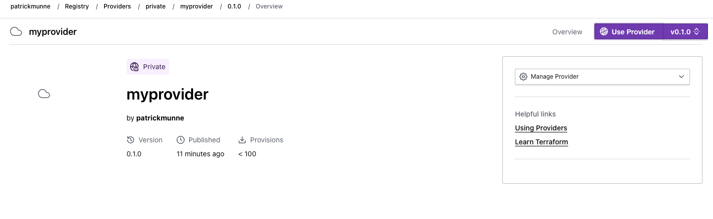
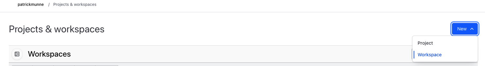
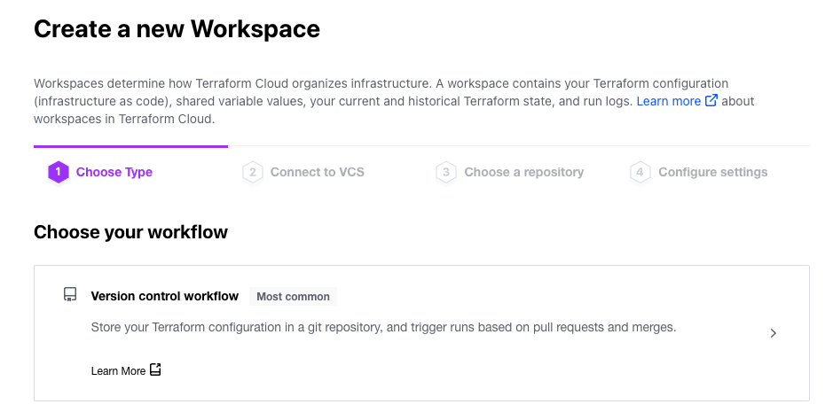
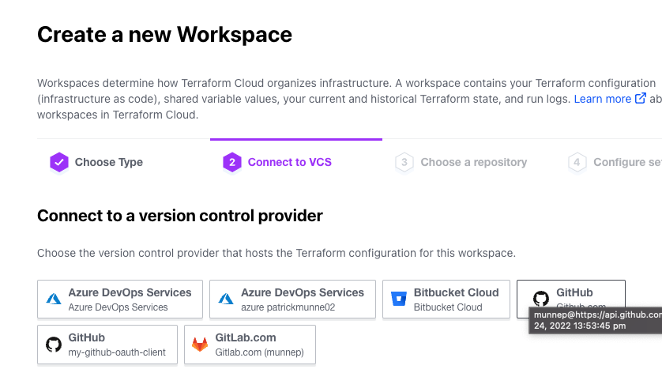
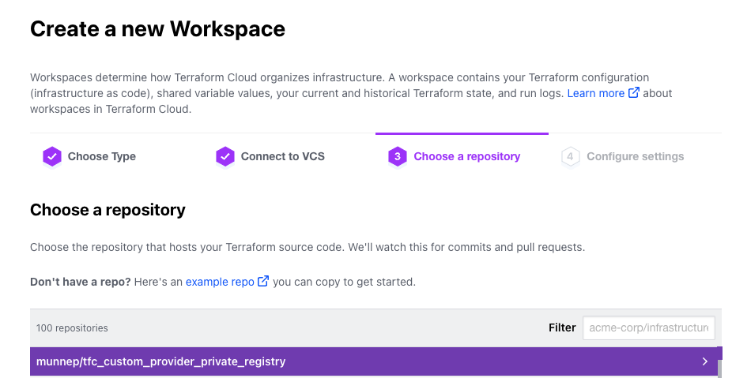
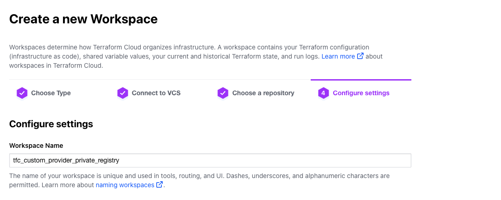
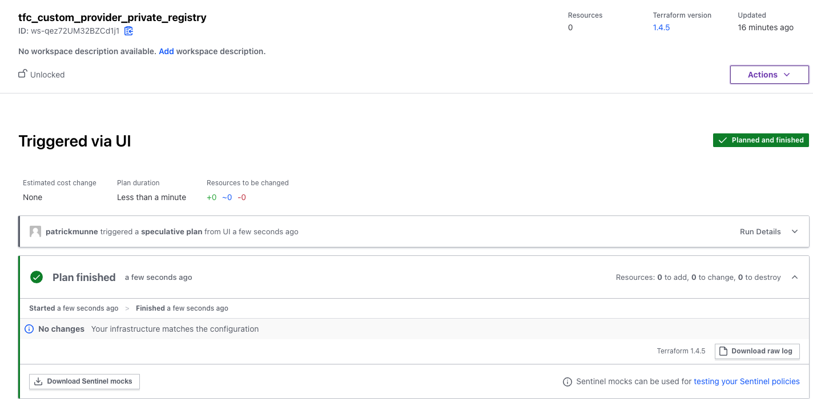
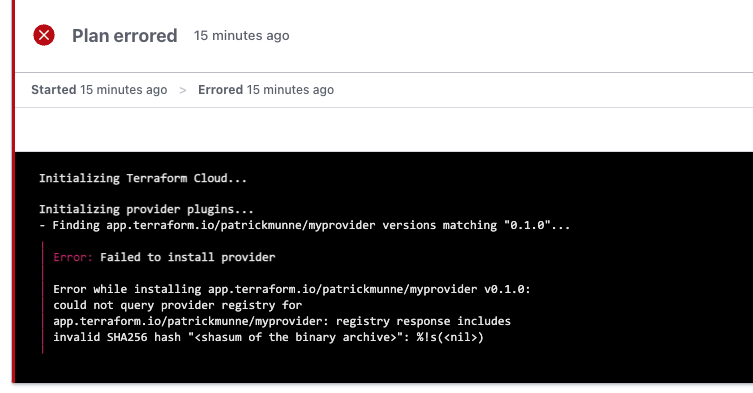

# tfc_customer_provider_registry

In this repository we will publish a custom provider to the Terraform Cloud Private registry and test if we done correctly. 

# Prerequisites

- The jq tool installed from [here](https://stedolan.github.io/jq/download/) 
- gnupg package installed from [here](https://gnupg.org/download/index.html)

## Create a gpg keypair
gpg keypair is necessary to sign the provider release. 

- Create a new gpg keypair
```sh
gpg --full-generate-key
```

- Choose the RSA algorithm. (you don't have to give it a password)
```sh
gpg (GnuPG) 2.4.0; Copyright (C) 2021 Free Software Foundation, Inc.
This is free software: you are free to change and redistribute it.
There is NO WARRANTY, to the extent permitted by law.

Please select what kind of key you want:
   (1) RSA and RSA
   (2) DSA and Elgamal
   (3) DSA (sign only)
   (4) RSA (sign only)
   (9) ECC (sign and encrypt) *default*
  (10) ECC (sign only)
  (14) Existing key from card
Your selection? 1
RSA keys may be between 1024 and 4096 bits long.
What keysize do you want? (3072) 
Requested keysize is 3072 bits
Please specify how long the key should be valid.
         0 = key does not expire
      <n>  = key expires in n days
      <n>w = key expires in n weeks
      <n>m = key expires in n months
      <n>y = key expires in n years
Key is valid for? (0) 
Key does not expire at all
Is this correct? (y/N) y

GnuPG needs to construct a user ID to identify your key.

Real name: patrick
Email address: patrick.xxxxx@xxxxxxx.com
Comment: patrick-testing
You selected this USER-ID:
    "patrick (patrick-testing) <patrick.xxxxx@xxxxx.com>"

Change (N)ame, (C)omment, (E)mail or (O)kay/(Q)uit? O
We need to generate a lot of random bytes. It is a good idea to perform
some other action (type on the keyboard, move the mouse, utilize the
disks) during the prime generation; this gives the random number
generator a better chance to gain enough entropy.
We need to generate a lot of random bytes. It is a good idea to perform
some other action (type on the keyboard, move the mouse, utilize the
disks) during the prime generation; this gives the random number
generator a better chance to gain enough entropy.
gpg: revocation certificate stored as '/Users/patrickmunne/.gnupg/openpgp-revocs.d/F4145CDC716A390607CC107BFB30E6EB12E726A5.rev'
public and secret key created and signed.

pub   rsa3072 2023-04-13 [SC]
      F4145CDC716A390607CC107BFB30E6EB12E726A5
uid                      patrick (patrick-testing) <patrick.munne@hashicorp.com>
sub   rsa3072 2023-04-13 [E]
```

- Export the public key
```sh
gpg -o gpg-key.pub -a --export <key id or email>
```
- You should have a `gpg-key.pub` in the directory where you executed the above command

### Extra notes

view current gpg keys
```sh
gpg -k 
```

# How to

I will use the null provider as my custom provider to upload to the TFC private registry. The provider in the private registry will be called `myprovider`

- Download the null provider for linux. We need the linux version because TFC executes your code on a linux container. 

```sh
curl -o terraform-provider-null_3.2.1_linux_amd64.zip https://releases.hashicorp.com/terraform-provider-null/3.2.1/terraform-provider-null_3.2.1_linux_amd64.zip
```
- unzip it as we only need the binary inside
```sh
unzip terraform-provider-null_3.2.1_linux_amd64.zip
```
- Rename the unzipped binary to match for `myprovider`
```sh
mv terraform-provider-null_v3.2.1_x5 terraform-provider-myprovider_v0.1.0_x5
```
- create a zipfile of this binary
```sh
zip terraform-provider-myprovider_0.1.0_linux_amd64.zip terraform-provider-myprovider_v0.1.0_x5
```
- We need to create the verification signature for this file
- Generate the checksum for the zipfile we created
```sh
shasum -a 256 terraform-provider-myprovider_0.1.0_linux_amd64.zip > terraform-provider-myprovider_0.1.0_SHA256SUMS
```
- Create a detached signature for the terraform-provider-myprovider_0.1.0_SHA256SUMS file using a gpg key. This will create a file called `terraform-provider-myprovider_0.1.0_SHA256SUMS.sig`
```sh
gpg -sb terraform-provider-myprovider_0.1.0_SHA256SUMS
```
- We should have the following files now to upload to the Terraform Cloud Private registry
```sh
terraform-provider-myprovider_0.1.0_SHA256SUMS
terraform-provider-myprovider_0.1.0_SHA256SUMS.sig
terraform-provider-myprovider_0.1.0_linux_amd64.zip
```
- Upload the provider to the private registry. This is currently only available using the API
- make sure you export your TFC token on the terminal before you continue
```sh
export TOKEN=<your API token for Terraform Cloud with the proper permissions>
```
- We need to have the `gpg-key.pub` contents in a single line in the payload we will be uploading. Execute the following command for this
```sh
sed 's/$/\\n/g' gpg-key.pub | tr -d '\n\r'
```
- Create the following `gpg-key-payload.json` with contents. Watch that you add the `\n` for the pgp key in the end
```json
{
  "data": {
    "type": "gpg-keys",
    "attributes": {
      "namespace": "<your-tfc-organization>",
      "ascii-armor": "-----BEGIN PGP PUBLIC KEY BLOCK-----\n\nmQINB...=txfz\n-----END PGP PUBLIC KEY BLOCK-----\n"
    }   
  }
}
```
- add the gpg private key to the Terraform Cloud
```json
curl -sS \
    --header "Authorization: Bearer $TOKEN" \
    --header "Content-Type: application/vnd.api+json" \
    --request POST \
    --data @gpg-key-payload.json \
    https://app.terraform.io/api/registry/private/v2/gpg-keys | jq '.'
```    
- From the output note the key-id. We will need this later
```json
      "key-id": "FB30E6EB12E726A5",
```      
- create a file called `provider-payload.json` where we prepare to upload the provider
```json
{
  "data": {
    "type": "registry-providers",
      "attributes": {
      "name": "myprovider",
      "namespace": "<your-tfc-organization>",
      "registry-name": "private"
    }
  }
}
```
- Make the API call with the previous payload
```json
curl -sS \
  --header "Authorization: Bearer $TOKEN" \
  --header "Content-Type: application/vnd.api+json" \
  --request POST \
  --data @provider-payload.json \
  https://app.terraform.io/api/v2/organizations/patrickmunne/registry-providers | jq '.'
```  
- create a version on the provider by creating a file called `provider-version-payload.json`
The gpg key is the one with got back a few steps ago
```json
{
  "data": {
    "type": "registry-provider-versions",
    "attributes": {
      "version": "0.1.0",
      "key-id": "<your-gpg-key-id>",
      "protocols": ["5.0"]
    }
  }
}
```
- Make the API call to create the version
```json
curl -sS \
  --header "Authorization: Bearer $TOKEN" \
  --header "Content-Type: application/vnd.api+json" \
  --request POST \
  --data @provider-version-payload.json \
  https://app.terraform.io/api/v2/organizations/patrickmunne/registry-providers/private/patrickmunne/myprovider/versions | jq '.'
```
- Write down the following output
```json
      "shasums-upload": "https://archivist.terraform.io/v1/object/dmF1bHQ6djI6RHJGL2Q1L09QdXc5R2k2TVV5cTZQcVYrUWZOM2NqdEdUcDQ5bEx0UnIzdENTZjR5Z2tWZjRTeldhbFFGb1Awa0IzMFNxN0dSbCtjZmV4eG1NVzJTSDc4VUtONE5iUkVVL1lDYTJLT0tTQ0lwdVEyL0V3M2Nvb2E2Tk13cXI0ci92M1VRQU5GYmpEeW9ZOEZwUS9iQnJZb1ZCeUExNW1tcUYxSEFmMWUreHRYaEZpNmwzV25Nc1RFU3FJZWtYMkM3YVp5S1R6N3gxdnhmY2taSnFFdldEbVhOMmwyRGQzRURsTXZ0ak5JejRIcFdBQW5wWVAyQVRwd1RIVkgvdzVndDViNmt1L2Z1Y0UzYzBodyswSCtYeE5idDhmS1NhZ0pTcnJhNlpndC9TaXc9",
      "shasums-sig-upload": "https://archivist.terraform.io/v1/object/dmF1bHQ6djI6aG1UVG5TellrWmdyYUJtY1pDUklHa1J1SE5IKy8wN281akVtaDVRd3RpUTAzU014dWN6eXMvS1VUUWZkakwzcWZyY1kvODk5YkczNlQ0a3hDaFRES0NDOWp0blZFRGxiWEYrQ3dWTGIvZTJJSEFNQWhhbXR4SExqTjBmdkJOYWJSUi9sSEF4WWwrT1ZkRk9kNytYb2dCa3pqcUJHMHdKYURqUkhsN3dhL29KblNxLzRrbVROcGRIcnNqRW1CSmljRFhVSUJCOTBUK0tOYVlVNWt4dzlSd295aGpZVWtQa3ZWT0twM3ozMVBNTUwyVWdVa0VVTThFT3FHbmt3ZWZTazZCZi9GamtMQndXTnNVakJjVGJxMUoxdzNnT2NBcmw0SWE3cWNFQkZ5US9ZVWdJYw"
```
- Upload the shasums file to the shasums-upload from the previous point
```sh
curl -T terraform-provider-myprovider_0.1.0_SHA256SUMS <URL from data.links.shasums-upload>
```
- Upload the shasums signature file to the shasums-sig-upload
```sh
curl -T terraform-provider-myprovider_0.1.0_SHA256SUMS.sig <URL from data.links.shasums-sig-upload>
```
- We need to start uploading the binaries
- Create a binary platform for linux using the API
- Create the following payload with file `provider-version-payload-platform.json`

shasum the shasum of the archive file containing the binary. Take it from the terraform-provider-myprovider_0.1.0_SHA256SUMS file.
```json
{
  "data": {
    "type": "registry-provider-version-platforms",
    "attributes": {
      "os": "linux",
      "arch": "amd64",
      "shasum": "1de4a728345f856181a40e887689118f775893461f88674d7b0d274d732b279f",
      "filename": "terraform-provider-myprovider_0.1.0_linux_amd64.zip"
    }
  }
}
```
- Make the API call
```sh
curl -sS \
  --header "Authorization: Bearer $TOKEN" \
  --header "Content-Type: application/vnd.api+json" \
  --request POST \
  --data @provider-version-payload-platform.json \
  https://app.terraform.io/api/v2/organizations/patrickmunne/registry-providers/private/patrickmunne/myprovider/versions/0.1.0/platforms | jq '.'
```
- Upload the binary to the provider-binary-upload from the previous point
```sh
curl -T terraform-provider-myprovider_0.1.0_linux_amd64.zip <URL from data.links.provider-binary-upload>
```
- Login to terraform Cloud and verify the private provider is available
  

## Verify the repository is working

- Fork this repository to your own environment
- Update the `main.tf` with the information of your own provider
```hcl
terraform {
  required_providers {
    myprovider = {
      source = "app.terraform.io/patrickmunne/myprovider"
      version = "0.1.0"
    }
  }
}
```
- Create a new workspace pointing to this repository
  
  
  
  
  
- Do a new run and the output should be the following. If the plan finished it proves the provider was downloaded and initialized
   
- If you get an error like the following you made a mistake somewhere
  
- In this case the shasum files were not uploaded correctly. I removed the version and did those steps again. Removed the version with the following API call

```sh
curl \
  --header "Authorization: Bearer $TOKEN" \
  --header "Content-Type: application/vnd.api+json" \
  --request DELETE \
  https://app.terraform.io/api/v2/organizations/patrickmunne/registry-providers/private/patrickmunne/myprovider/versions/0.1.0
```